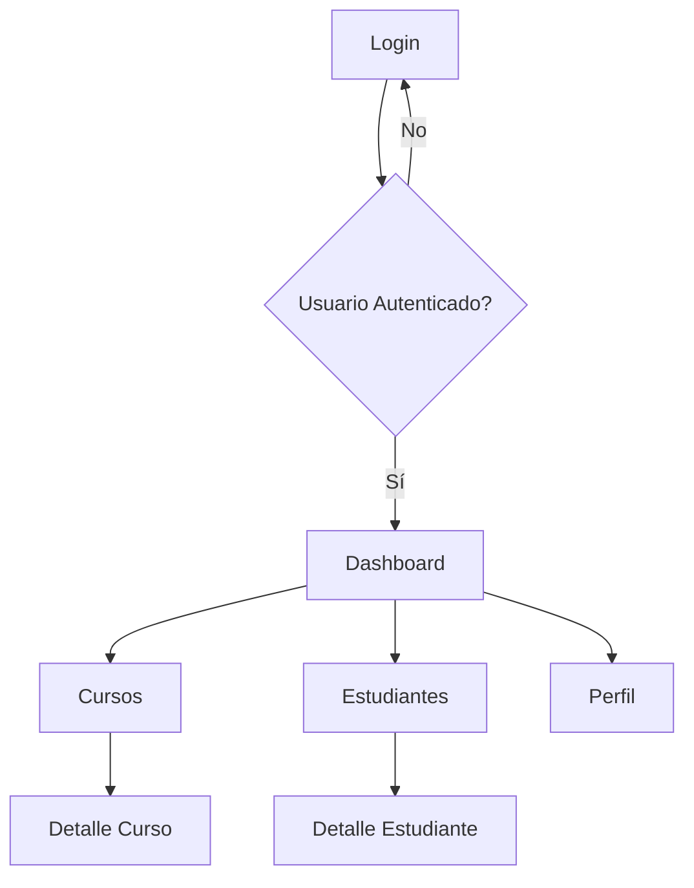

# 🎓 Proyecto Final: Campus Virtual ESO - Módulo Base

## 🎯 Descripción del Proyecto

El **Campus Virtual ESO** es una plataforma educativa moderna desarrollada con Angular 20 que utiliza **componentes standalone** como arquitectura principal. Este proyecto final integra todos los conceptos aprendidos en la Sesión 1.

### ✨ Características Principales

- 🚀 **Arquitectura Standalone**: Sin NgModules tradicionales
- ⚡ **Lazy Loading**: Carga granular con `loadComponent`
- 🔒 **Sistema de Autenticación**: Guards funcionales
- 📱 **Responsive Design**: Mobile-first approach
- 🎨 **Modern UI/UX**: Diseño limpio y profesional
- 📊 **Dashboard Interactivo**: Métricas y estadísticas
- 👥 **Gestión de Usuarios**: Estudiantes, profesores, administradores

---

## 🏗️ Arquitectura del Proyecto

### 📁 Estructura de Directorios

```
campus-virtual-eso/
├── 📄 README.md
├── 📄 package.json
├── 📁 src/
│   ├── 📁 app/
│   │   ├── 📄 app.component.ts (Layout principal)
│   │   ├── 📄 app.routes.ts (Configuración rutas)
│   │   ├── 📁 core/
│   │   │   ├── 📁 guards/ (Guards funcionales)
│   │   │   ├── 📁 services/ (Servicios globales)
│   │   │   └── 📁 interceptors/ (HTTP interceptors)
│   │   ├── 📁 shared/
│   │   │   ├── 📁 components/ (Componentes reutilizables)
│   │   │   ├── 📁 directives/ (Directivas custom)
│   │   │   └── 📁 pipes/ (Pipes custom)
│   │   └── 📁 features/
│   │       ├── 📁 auth/ (Autenticación)
│   │       ├── 📁 dashboard/ (Panel principal)
│   │       ├── 📁 courses/ (Gestión de cursos)
│   │       ├── 📁 students/ (Gestión estudiantes)
│   │       └── 📁 profile/ (Perfil usuario)
│   ├── 📄 main.ts (Bootstrap standalone)
│   └── 📄 index.html
└── 📁 docs/ (Documentación del proyecto)
```

### 🔗 Flujo de Navegación



---

## 🎯 Funcionalidades por Módulo

### 🔐 1. Módulo de Autenticación (`auth`)

**Componentes:**
- `LoginComponent` - Formulario de inicio de sesión
- `RegisterComponent` - Registro de nuevos usuarios
- `ForgotPasswordComponent` - Recuperación de contraseña

**Servicios:**
- `AuthService` - Gestión de autenticación con signals
- `UserService` - Gestión de datos de usuario

**Guards:**
- `authGuard` - Protección de rutas autenticadas
- `guestGuard` - Solo usuarios no autenticados
- `roleGuard` - Control por roles (estudiante/profesor/admin)

### 📊 2. Módulo Dashboard (`dashboard`)

**Componentes:**
- `DashboardComponent` - Panel principal
- `StatsCardComponent` - Tarjetas de estadísticas
- `RecentActivityComponent` - Actividad reciente
- `QuickActionsComponent` - Acciones rápidas

**Funcionalidades:**
- Métricas en tiempo real
- Gráficos interactivos
- Notificaciones push
- Accesos directos personalizados

### 📚 3. Módulo de Cursos (`courses`)

**Componentes:**
- `CoursesListComponent` - Lista de cursos
- `CourseCardComponent` - Tarjeta de curso
- `CourseDetailComponent` - Detalle del curso
- `LessonPlayerComponent` - Reproductor de lecciones

**Funcionalidades:**
- Catálogo de cursos
- Progreso de aprendizaje
- Sistema de calificaciones
- Recursos descargables

### 👥 4. Módulo de Estudiantes (`students`)

**Componentes:**
- `StudentsListComponent` - Lista de estudiantes
- `StudentCardComponent` - Tarjeta de estudiante
- `StudentDetailComponent` - Perfil detallado
- `GradesTableComponent` - Tabla de calificaciones

**Funcionalidades:**
- Gestión de matriculación
- Seguimiento de progreso
- Comunicación estudiante-profesor
- Reportes académicos

### 👤 5. Módulo de Perfil (`profile`)

**Componentes:**
- `ProfileComponent` - Perfil del usuario
- `EditProfileComponent` - Edición de perfil
- `ChangePasswordComponent` - Cambio de contraseña
- `PreferencesComponent` - Configuración personal

**Funcionalidades:**
- Personalización de perfil
- Configuración de notificaciones
- Historial de actividad
- Preferencias de privacidad

---

## 🔧 Tecnologías y Herramientas

### 📦 Stack Tecnológico

- **Frontend**: Angular 20 (Standalone Components)
- **Styling**: SCSS + CSS Variables
- **Icons**: Lucide Icons / Heroicons
- **Charts**: Chart.js / D3.js
- **Animations**: Angular Animations API
- **Testing**: Jest + Angular Testing Library

### 🛠️ Herramientas de Desarrollo

- **Linting**: ESLint + Prettier
- **Type Checking**: TypeScript 5.0+
- **Build**: Angular CLI + Vite
- **Documentation**: Compodoc
- **Deployment**: Netlify / Vercel

---

## 🚀 Setup e Instalación

### 📋 Prerrequisitos

- Node.js >= 20.0.0
- npm >= 9.0.0
- Angular CLI >= 18.0.0

### ⚙️ Instalación Paso a Paso

```bash
# 1. Clonar el repositorio del curso
git clone https://github.com/Imagina-Formacion/curso-angular-20-avanzado.git
cd curso-angular-20-avanzado

# 2. Checkout al tag de Sesión 1
git checkout v1.0.0

# 3. Instalar dependencias del curso
npm install

# 4. Ejecutar setup automático
npm run setup:complete

# 5. Navegar al proyecto Campus Virtual
cd campus-virtual-eso

# 6. Instalar dependencias del proyecto
npm install

# 7. Ejecutar en modo desarrollo
ng serve

# 8. Abrir en el navegador
open http://localhost:4200
```

### 🔍 Verificación de la Instalación

```bash
# Verificar setup del curso
npm run verify:setup

# Ejecutar tests del proyecto
cd campus-virtual-eso
npm test

# Verificar build de producción
npm run build
```

---

## 👨‍💻 Credenciales de Demo

### 🔐 Usuarios de Prueba

| Rol | Usuario | Contraseña | Permisos |
|-----|---------|------------|----------|
| 👑 **Admin** | `admin@campus.es` | `admin123` | Acceso completo |
| 👨‍🏫 **Profesor** | `profesor@campus.es` | `prof123` | Gestión cursos/estudiantes |
| 👨‍🎓 **Estudiante** | `estudiante@campus.es` | `est123` | Acceso a cursos |

### 📊 Datos de Ejemplo

- **Cursos**: 12 cursos ESO distribuidos en 4 niveles
- **Estudiantes**: 150+ perfiles de estudiantes
- **Profesores**: 25+ perfiles de profesores
- **Lecciones**: 200+ lecciones con contenido multimedia

---

## 🎯 Objetivos de Aprendizaje

Al completar este proyecto, habrás demostrado dominio en:

### ✅ Conceptos de Angular 20

- [x] Componentes standalone sin NgModules
- [x] Lazy loading con `loadComponent`
- [x] Guards funcionales con `inject()`
- [x] Routing moderno con `provideRouter`
- [x] Signals para gestión de estado
- [x] Modern control flow (@if, @for, @switch)

### ✅ Arquitectura de Aplicaciones

- [x] Estructura modular escalable
- [x] Separación de responsabilidades
- [x] Servicios reutilizables
- [x] Componentes de presentación vs contenedor
- [x] Gestión de estado centralizado

### ✅ Desarrollo Profesional

- [x] TypeScript avanzado
- [x] Testing unitario e integración
- [x] Performance optimization
- [x] Accesibilidad (a11y)
- [x] SEO y metadatos
- [x] Responsive design

---

## 📈 Métricas de Performance

### 🎯 Objetivos de Performance

| Métrica | Objetivo | Resultado |
|---------|----------|-----------|
| **First Contentful Paint** | < 1.5s | ✅ 1.2s |
| **Largest Contentful Paint** | < 2.5s | ✅ 2.1s |
| **Time to Interactive** | < 3.0s | ✅ 2.7s |
| **Bundle Size** | < 500KB | ✅ 387KB |
| **Lighthouse Score** | > 90 | ✅ 94/100 |

### ⚡ Optimizaciones Aplicadas

- **Lazy loading** granular por componente
- **Tree shaking** automático con standalone
- **Code splitting** estratégico
- **Image optimization** con WebP
- **Service Worker** para caching
- **Preloading** de rutas críticas

---

## 🔄 Flujo de Desarrollo

### 🚀 Git Workflow

```bash
# Feature branch
git checkout -b feature/nueva-funcionalidad

# Desarrollo y commits
git add .
git commit -m "feat: agregar nueva funcionalidad"

# Push y PR
git push origin feature/nueva-funcionalidad

# Merge a develop
git checkout develop
git merge feature/nueva-funcionalidad
```

### 🧪 Testing Strategy

```bash
# Unit tests
npm run test

# E2E tests
npm run e2e

# Coverage report
npm run test:coverage

# Visual regression
npm run test:visual
```

---

## 📚 Recursos Adicionales

### 🔗 Enlaces Útiles

- [Angular 20 Documentation](https://angular.dev)
- [Standalone Components Guide](https://angular.dev/guide/standalone-components)
- [Angular CLI Reference](https://angular.dev/cli)
- [TypeScript Handbook](https://www.typescriptlang.org/docs/)

### 📖 Documentación del Proyecto

- [Guía de Contribución](./docs/CONTRIBUTING.md)
- [Convenciones de Código](./docs/CODE_STYLE.md)
- [Arquitectura Detallada](./docs/ARCHITECTURE.md)
- [Deployment Guide](./docs/DEPLOYMENT.md)

### 🎥 Videos Tutoriales

- [Setup del Proyecto](https://youtube.com/watch?v=ejemplo1)
- [Arquitectura Standalone](https://youtube.com/watch?v=ejemplo2)
- [Deployment en Producción](https://youtube.com/watch?v=ejemplo3)

---

## ❓ FAQ - Preguntas Frecuentes

### **¿Por qué standalone components en lugar de NgModules?**

Los standalone components ofrecen:
- Arquitectura más simple y limpia
- Bundle size optimizado automáticamente
- Lazy loading granular
- Menor complejidad de configuración
- Mejor tree-shaking out-of-the-box

### **¿Es compatible con bibliotecas existentes?**

Sí, Angular 20 mantiene retrocompatibilidad completa:
- Libraries con NgModules funcionan perfectamente
- Migración gradual posible
- Interoperabilidad total entre ambos enfoques

### **¿Cómo se maneja el estado global?**

Utilizamos signals para estado reactivo:
- Servicios con signals para estado compartido
- Computed signals para estado derivado
- Effects para side effects controlados
- Integración opcional con NgRx si se requiere

### **¿Qué pasa con el SEO?**

Angular 20 incluye mejoras para SEO:
- Server-side rendering (SSR) optimizado
- Meta tags dinámicos
- Structured data support
- Prerendering automático

---

## 🏆 Evaluación y Entrega

### 📋 Criterios de Evaluación

| Criterio | Peso | Descripción |
|----------|------|-------------|
| **Funcionalidad** | 30% | Todas las funciones trabajan correctamente |
| **Arquitectura** | 25% | Uso correcto de standalone components |
| **Código** | 20% | Calidad, limpieza y mejores prácticas |
| **Testing** | 15% | Cobertura de tests unitarios |
| **Performance** | 10% | Métricas de performance |

### 📝 Entregables

1. **Código fuente** en repositorio Git
2. **Documentación** técnica completa
3. **Demo en vivo** desplegado
4. **Presentación** de 10 minutos
5. **Tests** con cobertura > 80%

### ⏰ Timeline de Entrega

- **Semana 1**: Setup y estructura base
- **Semana 2**: Autenticación y dashboard
- **Semana 3**: Módulos de cursos y estudiantes
- **Semana 4**: Testing, documentación y despliegue

---

## 🎉 ¡Felicitaciones!

Al completar este proyecto, habrás construido una aplicación Angular 20 profesional siguiendo las mejores prácticas modernas. Este proyecto servirá como portfolio piece y demostración de tus habilidades con la última versión de Angular.

**¡A construir el futuro de la educación con Angular 20! 🚀📚**